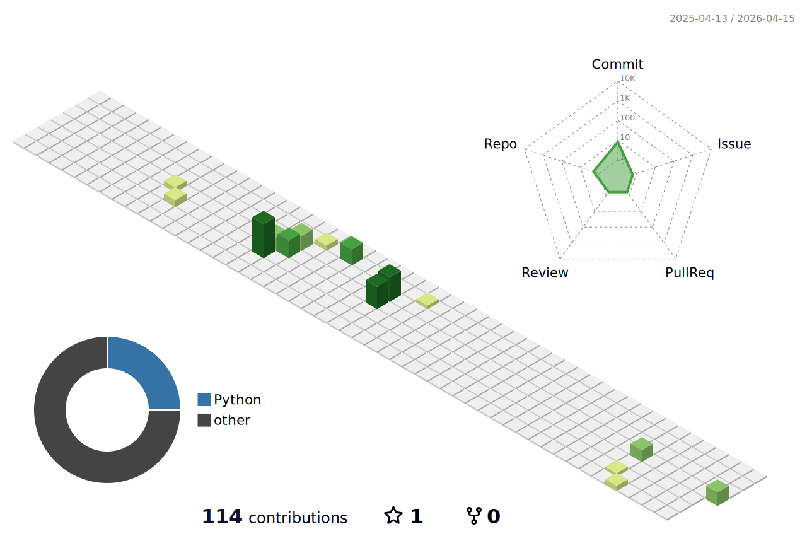

# I build backend systems that don't break under pressure.

**Backend Engineer** · 4+ years in production · Asunción, Paraguay 🇵🇾  
🟢 **Open to remote** — Backend / Platform / Full-Stack roles

---

## By the numbers

| Metric | Scale |
|--------|-------|
| Active traders on a single platform | **3M+** |
| Transactions processed daily | **Millions** |
| Uptime maintained | **99.9%+** |
| Third-party APIs integrated | **10+** |
| Global offices collaborated with | **20** |
| Years in production backend systems | **4+** |

---

## Stack

**Backend**  

**Frontend**  

**Databases**  

**DevOps & Infrastructure**  

**Monitoring**  

---

## Experience

**Software Engineer @ [FortyAU](https://fortyau.com)** *(Aug 2024 – Jun 2025)*  
Full-stack delivery across PHP, C#, Angular, React & Kotlin for 5+ client projects in healthcare, entertainment, and business automation. Owned DevOps, QA, and DBA simultaneously across 3 time zones with zero critical incidents.

**Backend Developer @ [Deriv.com](https://deriv.com)** *(Sep 2021 – Aug 2024)*  
Microservices infrastructure (Perl-Myriad, Docker, PostgreSQL, Node.js) for a platform with 3M+ active traders. Real-time processing of forex, crypto, stocks & commodities at global scale. Integrated 10+ third-party APIs. Mentored engineers on Perl-Myriad patterns.

---

## Certifications

- 🤖 AI Dev Course — BIG School *(2025)*
- 📊 Monitoring & Observability with Datadog *(2024)*
- 🐙 Career Essentials in GitHub — GitHub *(2024)*
- 🔴 Redis Streams RU202 — Redis University *(2022)*
- 🔴 Redis Data Structures RU101 — Redis University *(2022)*
- 🐪 Perl Essentials — Geekuni *(2021)*

---

## Education

- **Ingeniería en Mecatrónica** — UCSA *(2021 – Present)*
- **CS50: Introduction to Computer Science** — Harvard University *(2020)*

---

## GitHub Stats

  
  

  

---

*Trilingual: EN / ES / PT · Perl expertise (rare globally) · Remote-first*
