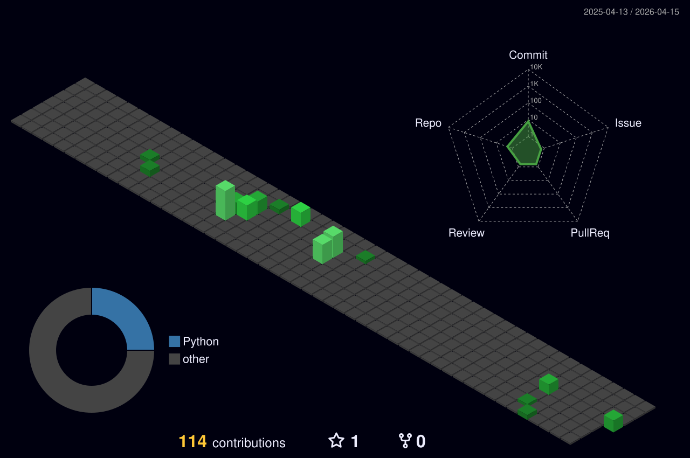

# Eduardo Rubbini

**Backend Engineer** · 4+ years building distributed, production-grade systems · Asunción, Paraguay 🇵🇾

---

## About

I design and maintain backend systems that hold up under real load. Over 4+ years in production, I've built and operated microservices infrastructure for a fintech platform serving **3M+ active traders**, processing **millions of transactions daily** while sustaining **99.9%+ uptime**.

My focus is distributed architecture: services that fail independently instead of together, data paths that stay consistent under concurrency, and systems built to be understood and operated by someone other than the person who wrote them.

---

## Tech Stack & Tools

**Backend**

Includes hands-on work with **Perl-Myriad**, the async microservices framework used to build and scale real-time trading infrastructure.

**Databases**

**Infrastructure**

**Frontend** *(secondary)*

---

## Engineering Philosophy

- **Design for the load that actually shows up.** Architecture decisions get validated against real traffic patterns and failure modes, not idealized ones.
- **Reliability is a feature, not an afterthought.** Uptime and data consistency are treated as first-class requirements, especially in systems where mistakes cost money.
- **Automate what's worth automating.** CI/CD, testing, and repetitive operational tasks get automated; automation for its own sake doesn't.
- **Keep architecture legible.** A service that only its author can operate is a liability. I optimize for systems the next engineer can read, extend, and debug at 3am.

---

## 🚧 Master Architecture Showcase — *Coming Soon*

**Status: In progress.** I'm currently working toward an AWS certification, and once that's complete I plan to build and document a reference project here: a fully worked distributed system demonstrating microservices design, deployment, and operational practices end-to-end.

This section is a placeholder — nothing to see yet, but check back.

---

## Experience

**Freelance Backend Engineer** *(Jun 2025 – Present)*
Independent contract work across backend and full-stack projects.

**Software Engineer @ [FortyAU](https://fortyau.com)** *(Aug 2024 – Jun 2025)*
Full-stack delivery across PHP, C#, Angular, React & Kotlin for multiple client projects spanning healthcare, entertainment, and business automation. Owned DevOps, QA, and DBA responsibilities across 3 time zones with zero critical incidents.

**Backend Developer @ [Deriv.com](https://deriv.com)** *(Sep 2021 – Aug 2024)*
Built and maintained microservices infrastructure (Perl-Myriad, Docker, PostgreSQL, Node.js) for a fintech platform with 3M+ active traders, processing millions of transactions daily at 99.9%+ uptime. Real-time processing of forex, crypto, stocks & commodities at global scale. Integrated 10+ third-party APIs.

---

## Certifications

- 🤖 AI Dev Course — BIG School *(2025)*
- 📊 Monitoring & Observability with Datadog *(2024)*
- 🐙 Career Essentials in GitHub — GitHub *(2024)*
- 🔴 Redis Streams RU202 — Redis University *(2022)*
- 🔴 Redis Data Structures RU101 — Redis University *(2022)*
- 🐪 Perl Essentials — Geekuni *(2021)*

---

## Education

- **Ingeniería en Mecatrónica** — UCSA *(2021 – Present)*
- **CS50: Introduction to Computer Science** — Harvard University *(2020)*

---

## GitHub Stats

  

  

---

*Trilingual: EN / ES / PT · Remote-first*
